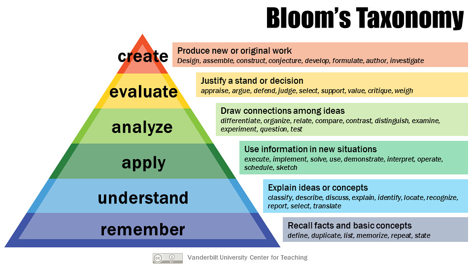

Encoding
##################################

(Summary from `this video <https://www.youtube.com/watch?v=VcT8puLpNKA>`_ by Justin Sung).

**DISCLAIMER: I do not own any of the images used in here. They are taken from the video that Justin doodled/used.**

Takeaways
====================

#. Part 1: (`8:50 <https://www.youtube.com/watch?v=VcT8puLpNKA&t=530s>`_) Engage in higher order learning 

    .. image:: img/007encoding02.png
      :width: 300
      :alt: Encoding 02

#. Part 2: (`14:50 <https://www.youtube.com/watch?v=VcT8puLpNKA&t=890s>`_) Train cognitive load tolerance

      .. image:: img/007encoding03.png
      :width: 300
      :alt: Encoding 03
      
Details
========================
  
Bloom's Taxonomy: https://tophat.com/blog/blooms-taxonomy/
