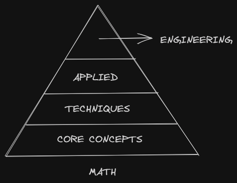

Mathematics
#####################################################################

Mathematics provides a precise description of some of the concepts we find useful. However, once expressed in a formal language, the treatment of mathematical principles on mathematical objects is completely divorced from the practicality that gave rise to it. This power of abstraction allows the concepts to be organised in a layered fashion, with each layer adding a concisely defined notion of how the objects could behave. 

While mathematical principles often find their origins in *specific* problems, where it truly succeeds is when it finds certain *generic* patterns that are prevalent across problems of different domains, related or unrelated. These often show up as a recurring theme across various disciplines of Mathematics. To preserve this spirit, I will try to capture my understanding of this subject in the following fashion:

Core Concepts
========================================
These are meant to capture the underlying theme of certain recurring concepts in mathematics. For example, the concept of a basis, which is found in the digital representation of numbers, vector spaces, topological spaces, function spaces, etc.

- Concept of set
- Concept of operator
- Concept of a basis
- Concept of convergence

.. toctree::

   math/index

Techniques
========================================
The core concepts, when described for a particular type of mathematical object, often require specific techniques to realise. For example, basis in vector spaces are realised via the technique of Eigendecomposition.

Applied
========================================
The techniques that we use to explore a core concept are often useful for some other *mathematical* problem. For example, we can use Eigendecomposition to compute matrix power or matrix exponentiation.

Engineering
========================================
This refers to the application to *real-world* problems. For example, we can compute PageRank using matrix exponentiation.
