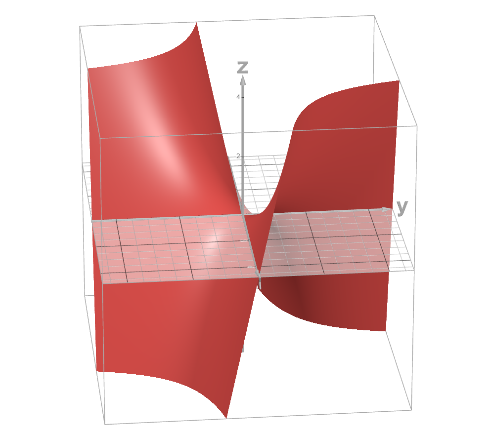
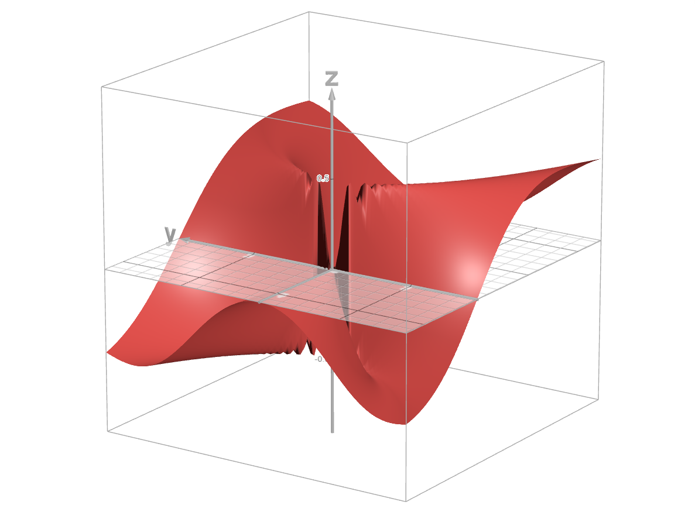

##########################################################
Multivariable Calculus
##########################################################
We consider functions from :math:`\mathbb{R}^n` to :math:`\mathbb{R}^m` which are expressed as

	.. math:: \mathbf{f}(\mathbf{x})=\mathbf{f}(x_1,\cdots,x_n)=(f_1(\mathbf{x}),\cdots,f_m(\mathbf{x}))

**********************************************************
Different Forms of Multivariable Functions
**********************************************************
Parametric Surface
==========================================================
.. note::
	* If :math:`n=1` and :math:`m > 1` then the functions :math:`f:\mathbb{R}\mapsto\mathbb{R}^m` are known as parametric sufraces.
	* Example: :math:`f(x)=(x, x^2)`

Scalar field
==========================================================
.. note::
	* If :math:`n> 1` and :math:`m=1` then the functions :math:`f:\mathbb{R}^n\mapsto\mathbb{R}` are known as scalar fields.
	* Example: :math:`f(x,y)=xy`

Vector field
==========================================================
.. note::
	* If :math:`n> 1` and :math:`m> 1` then the functions :math:`\mathbf{f}:\mathbb{R}^n\mapsto\mathbb{R}^m` are known as vector fields.
	* Example: :math:`f(x,y)=(x^2,\sin(y),x+y)`

**********************************************************
Continuity
**********************************************************
.. note::
	* We have a function :math:`\mathbf{f}`, from an open set :math:`E\in\mathbb{R}^n` into :math:`\mathbb{R}^m`.
	* A function is continuous at a point if each of its components, :math:`f_k(\mathbf{x})` is continuous at that point.

**********************************************************
Differentiation
**********************************************************
Directional Derivative as a rate of change in scalar fields
==============================================================
We have a function :math:`f`, from an open set :math:`E\in\mathbb{R}^n` into :math:`\mathbb{R}`. We want to find a proper definition of derivative of :math:`f` at some point :math:`\mathbf{x}\in E`.

.. note::
	* If the domain was in :math:`\mathbb{R}`, there is a single direction along which we can approach a point :math:`x\in\mathbb{R}`.
	* As the domain now is in :math:`\mathbb{R}^n`, there are infinite directions along which we can approach a point :math:`\mathbf{x}\in\mathbb{R}^n`.
	* Along each such direction, the rate-of-change in the function can be different.
	* In order to apply the notion of single variable derivative, we can therefore reduce the function to a single dimensional one by looking at the slice along a particular line.
	* We fix our direction along some vector :math:`\mathbf{u}\in\mathbb{R}^n` and look at the rate-of-change of the function along :math:`\mathbf{u}` as we move closer to :math:`\mathbf{x}`.
	* For some :math:`h> 0`, we assume an open-ball around :math:`\mathbf{x}` of radius :math:`h\cdot||\mathbf{u}||`, and define the ratio

		.. math:: \frac{f(\mathbf{x}+h\cdot\mathbf{u})-f(\mathbf{x})}{h}
	* We define a version of derivative as :math:`f'(\mathbf{x}; \mathbf{u})=\lim\limits_{h\to 0}\frac{f(\mathbf{x}+h\cdot\mathbf{u})-f(\mathbf{x})}{h}`

.. attention::
	We note that the open ball in this case is essentially an equivalent of an one dimensional interval.

.. note::
	* If :math:`\mathbf{u}` happens to a unit-vector, then our open ball is :math:`B_h(\mathbf{x})`.
	* In this case, :math:`\mathbf{f}'(\mathbf{x}; \mathbf{u})` is called the directional derivative along :math:`\mathbf{u}`.

Partial Derivative
------------------------------------------------------------
.. note::
	* If the unit vector in a directional derivative is along any of the coordinate-axes, such as :math:`\mathbf{e}_k`, the directional derivative is called a partial derivative.
	* Notation: :math:`\mathbf{f}'(\mathbf{x}; \mathbf{e}_k)=\frac{\mathop{\partial}}{\mathop{\partial x_k}}\mathbf{f}(\mathbf{x})`

Directional Derivative isn't sufficient
------------------------------------------------------------
.. warning::
	* A nice property of derivatives for single variable case is that if it exists at a given point, it implies that the function is continuous at that particular point.
	* HOWEVER, existence of direcitional derivatives doesn't imply continuity.

Example
^^^^^^^^^^^^^^^^^^^^^^^^^^^^^^^^^^^^^^^^^^^^^^^^^^^^^^^^^^^^
.. seealso::
	* We consider a scalar field 

		.. math:: f(x,y)=\begin{cases}\frac{xy^2}{x^2+y^4} & x\neq 0\\0 & x=0\end{cases}
	* We consider any arbitrary vector :math:`\mathbf{u}=(u_x,u_y)` where :math:`u_x\neq 0` and consider :math:`f'(x,y;\mathbf{u})` at :math:`\mathbf{0}`.

		.. math:: \frac{f(\mathbf{0}+h\mathbf{u})-f(\mathbf{0})}{h}=\frac{f(h\mathbf{u})}{h}=\frac{f(hu_x,hu_y)}{h}=\frac{hu_x(hu_y)^2}{h((hu_x)^2+(hu_y)^4)}=\frac{u_xu_y^2}{u_x^2+h^2u_y^4}
	* Therefore, :math:`f'(x,y;\mathbf{u})=\lim\limits_{h\to 0}\frac{u_xu_y^2}{u_x^2+h^2u_y^4}=\frac{u_y^2}{u_x}` which exists for all such :math:`\mathbf{u}`.
	* We now consider another vector :math:`\mathbf{v}=(0,v_y)` and consider :math:`f'(x,y;\mathbf{v})` at :math:`\mathbf{0}`.

		.. math:: \frac{f(\mathbf{0}+h\mathbf{v})-f(\mathbf{0})}{h}=\frac{f(h\mathbf{v})}{h}=\frac{f(0,hv_y)}{h}=0
	* Therefore, a directional derivative exists along every conceivable direction.

.. warning::
	* However, we note that along the parabolic path :math:`x=y^2`, :math:`f(x,y)=\frac{1}{2}`.
	* This means that if we move along this parabolic path, the value of the function jumps from :math:`\frac{1}{2}` to 0 all of a sudden.
	* No directional derivative along any straight line can catch this jump, as along that line, we can always form tiny open balls which excludes the points in the parabola.
	* Therefore, directional, and by extension, partial derivatives don't define a proper differentiation.

Total Derivative as a linear approximation in general
==========================================================
We define the total derivative as a linear approximation of the function at close proximity of :math:`\mathbf{x}`.

.. note::
	* Instead of checking from a single direction, we need to consider all directions at once.
	* Therefore, we consider a variable length vector :math:`\mathbf{h}` which is allowed to rotate.
	* We consider the **open-hypersphere** :math:`B_\mathbf{h}(\mathbf{x})`, and assume that inside this, the function is approximately linear.
	* Therefore, we introduce a linear transform :math:`\mathbf{A}:\mathbb{R}^n\mapsto\mathbb{R}^m` to replace our original function :math:`\mathbf{f}:\mathbb{R}^n\mapsto\mathbb{R}^m`.
	* The **change in value** as we move from :math:`\mathbf{x}` to :math:`\mathbf{x}+\mathbf{h}` is

		* :math:`\mathbf{f}(\mathbf{x}+\mathbf{h})-\mathbf{f}(\mathbf{x})` under the actual function.
		* :math:`\mathbf{A}(\mathbf{x}+\mathbf{h})-\mathbf{A}(\mathbf{x})=\mathbf{A}\mathbf{h}` under the approximation.
	* The error in this approximation is 

		.. math:: \boldsymbol{\epsilon}_\mathbf{x}(\mathbf{h})=\mathbf{f}(\mathbf{x}+\mathbf{h})-\mathbf{f}(\mathbf{x})-\mathbf{A}\mathbf{h}
	* We assume that :math:`\lim\limits_{\mathbf{h}\to\mathbf{0}}\frac{||\boldsymbol{\epsilon}_\mathbf{x}(\mathbf{h})||}{||\mathbf{h}||}=0` and define :math:`\mathbf{f}'(\mathbf{x})=\mathbf{A}`.

Gradient
------------------------------------------------------------
.. note::
	* If :math:`m=1`, then :math:`\mathbf{A}` is usually written as a column vector instead of a :math:`1\times n` matrix which is known as the gradient.

		.. math:: \nabla f(\mathbf{x}) =\begin{bmatrix}\frac{\mathop{\partial f(\mathbf{x})}}{\mathop{\partial x_1}}\\ \vdots \\ \frac{\mathop{\partial f(\mathbf{x})}}{\mathop{\partial x_n}}\end{bmatrix}
	* At any point :math:`\mathbf{x}`, the directional derivative along any :math:`\mathbf{v}` is given by

		.. math:: f'(\mathbf{x};\mathbf{v})=\nabla f(\mathbf{x})\cdot\mathbf{v}=\sum_{i=1}^n\frac{\mathop{\partial f(\mathbf{x})}}{\mathop{\partial x_i}}\cdot v_i
	* The total derivative operator :math:`D` in this case is the gradient operator

		.. math:: \nabla =\begin{bmatrix}\frac{\mathop{\partial}}{\mathop{\partial x_1}}\\ \vdots \\ \frac{\mathop{\partial}}{\mathop{\partial x_n}}\end{bmatrix}

Jacobian
------------------------------------------------------------
.. note::
	* If :math:`m> 1`, :math:`\mathbf{A}` is known as Jacibian matrix.

		.. math:: J_\mathbf{f}(\mathbf{x})=\begin{bmatrix}\nabla f_1(\mathbf{x})^\top\\ \vdots \\ \nabla f_m(\mathbf{x})^\top\end{bmatrix}=\begin{bmatrix}\frac{\mathop{\partial f_1(\mathbf{x})}}{\mathop{\partial x_1}} & \cdots & \frac{\mathop{\partial f_1(\mathbf{x})}}{\mathop{\partial x_n}} \\ \vdots & \vdots & \vdots \\ \frac{\mathop{\partial f_m(\mathbf{x})}}{\mathop{\partial x_1}} & \cdots & \frac{\mathop{\partial f_m(\mathbf{x})}}{\mathop{\partial x_n}}\end{bmatrix}

Differentiability : Continuously Differentiable Functions
===========================================================
.. warning::
	* Since we've established that the partial derivatives can exist at a point even when the function is not continuous at that point, let alone be differentiable, the existance of the gradient or the Jacobian doesn't imply that the function is differentiable at any point.

.. note::
	* The function is differentiable at :math:`\mathbf{x}` if all the partial derivatives exist and are **continuous** at :math:`\mathbf{x}`.
	* If the function is differentiable at :math:`\mathbf{x}`, it is continuous at :math:`\mathbf{x}`. All is good in the world.

Higher Order Derivative
===========================================================

Hessian
------------------------------------------------------------

**********************************************************
Useful Results
**********************************************************

.. csv-table:: Table for derivatives
	:header: "Scalar derivative", "Vector derivative"
	:align: center

	:math:`f(x)\to\frac{\mathop{d}}{\mathop{dx}}f(x)`, :math:`f(\mathbf{x})\to\frac{\mathop{d}}{\mathop{d\mathbf{x}}}f(\mathbf{x})`
	:math:`bx\to b`, :math:`\mathbf{x}^\top\mathbf{b}/\mathbf{b}^\top\mathbf{x}\to \mathbf{b}`
	:math:`ax\to a`, :math:`\mathbf{x}^\top\mathbf{A}\to \mathbf{A}`
	:math:`a^2x\to a^2`, :math:`\mathbf{a}^\top\mathbf{X}^\top\mathbf{a}/\mathbf{a}^\top\mathbf{X}\mathbf{a}\to \mathbf{a}\mathbf{a}^\top`
	:math:`abx\to ab`, :math:`\mathbf{a}^\top\mathbf{X}\mathbf{b}\to \mathbf{a}\mathbf{b}^\top`	
	:math:`abx\to ab`, :math:`\mathbf{a}^\top\mathbf{X}^\top\mathbf{b}\to \mathbf{b}\mathbf{a}^\top`
	:math:`x^2\to 2x`, :math:`\mathbf{x}^\top\mathbf{x}\to 2\mathbf{x}`
	:math:`ax^2\to 2ax`, :math:`\mathbf{x}^\top\mathbf{A}\mathbf{x}\to (\mathbf{A}+\mathbf{A}^\top)\mathbf{x}`
	:math:`abx^2\to 2abx`, :math:`\mathbf{b}^\top\mathbf{X}^\top\mathbf{X}\mathbf{a}\to \mathbf{X}(\mathbf{a}\mathbf{b}^\top+\mathbf{b}\mathbf{a}^\top)`

.. seealso::
	Plethora of useful results: `Matrix Cookbook <https://www.math.uwaterloo.ca/~hwolkowi/matrixcookbook.pdf>`_
