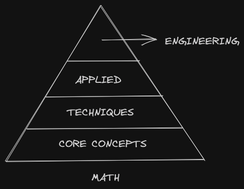

#####################################################################
Recurring Themes
#####################################################################

Mathematics provides a precise description of some of the concepts we find useful. However, once expressed in a formal language, the treatment of mathematical principles on mathematical objects is completely divorced from the practicality that gave rise to it. This power of abstraction allows the concepts to be organised in a layered fashion, with each layer adding a concisely defined notion of how the objects could behave. 

While mathematical principles often find their origins in *specific* problems, where it truly succeeds is when it finds certain *generic* patterns that are prevalent across problems of different domains, related or unrelated. These often show up as a recurring theme across various disciplines of Mathematics. To preserve this spirit, I will try to capture my understanding of this subject in the following fashion:

*********************************************************************
Core Concepts
*********************************************************************
These are meant to capture the underlying theme of certain recurring concepts in mathematics. For example, the concept of a basis, which is found in the digital representation of numbers, vector spaces, topological spaces, function spaces, etc.

- Concept of set
- Concept of operator
- Concept of a basis
- Concept of convergence

*********************************************************************
Techniques
*********************************************************************
The core concepts, when described for a particular type of mathematical object, often require specific techniques to realise. For example, basis in vector spaces are realised via the technique of Eigendecomposition.

*********************************************************************
Applied
*********************************************************************
The techniques that we use to explore a core concept are often useful for some other *mathematical* problem. For example, we can use Eigendecomposition to compute matrix power or matrix exponentiation.

*********************************************************************
Engineering
*********************************************************************
This refers to the application to *real-world* problems. For example, we can compute PageRank using matrix exponentiation.

*********************************************************************
North Star
*********************************************************************
Undergrad
=====================================================================
Based on `ISI B.Math <https://www.isibang.ac.in/~adean/infsys/acadata/Brochures/bmath_new.pdf>`_ Curricula

Sem 1

	- Real Analysis [single variable] - Apostol, Tao [up to integration]
	- Linear Algebra - Rao [chapter 1], Horn & Johnson, Axler
	- Probabilty - Feller [text] Pitman [problems], Ross
	- Number Theory - Niven

Sem 2

	- Real Analysis [single variable] - Apostol, Tao [integration onwards]
	- Linear Algebra - Rao [chapter 1], Horn & Johnson, Axler
	- Probabilty - Feller [text] Pitman [problems], Ross

Sem 3

	- Multivariate Analysis - Dineen
	- Group Theory - Dummit Foote, Artin
	- Statistical Inference - Casella Berger, Lehamann

Sem 4

	- Topology - Munkres, Janich
	- Rings and Modules - Dummit Foote, Artin
	- Ordinary Differential Equations - ??
	- Linear Models and Regression - Rao, Weisberg

Sem 5

	- Function Spaces - ??
	- Field and Galois Theory - Dummit Foote, Artin
	- Probability - Lanchier, Feller, Pitman, Ross
	- Information Theory - Cover & Thomas, Kullback	
	- Statistical Methods - Lehmann Nonparametrics, Berger Statistical Decision Theory, Gelman Bayesian Data Analysis
	- Algebraic Geometry - ??
	- Algebraic Topology - ??

Sem 6

	- Complex Analysis - Conway, Needham
	- Optimization - Boyd, Bertsekas, Rockafeller
	- Stochastic Process - Lanchier
	- Mathematics for Data Science - Vershynin, Wainwright, Hastie, Blum, Murphy
	- Differential Geometry - ??
	- Differential Topoligy - ??
	- Dynamical System - ??

Grad School
=====================================================================
Based on `ISI M.Math <https://www.isibang.ac.in/~adean/infsys/acadata/Brochures/mmath_new.pdf>`_ Curricula

Sem 1

	- Measure Theory - Royden
	- Linear Algebra - Halmos Finite Dimensional Vector Spaces
	- Algebra - Lang
	- Topology - ??
	- Multivariate Analysis - Spivak, Mukherjea

Sem 2

	- Complex Analysis - Ahlfros, Stein Shakarchi
	- Functional Analysis - Rudin, Conway
	- Topology - ??
	- Algebra - Rotman
	- Number Theory - ??

Sem 3

	- Differential Geometry - ??
	- Probabilty - Durret, Billingsley
	- Fourier Analysis - Stein Shakarchi, Rudin
	- Topics in Discrete Probabilty - ??
	- Advanced Functional Analysis - ??

Sem 4

	- Partial Differential Equations - ??
	- Differential Topology - ??
	- Random Measures and Geometry - ??
	- Dynamical System - ??
	- Topics in Gaussian Processes - ??

Esoteric

	- Martingle Theory - ??
	- Theory of Large Deviations - ??
	- Brownian Motion and Diffusions - ??
	- Weak Convergence and Empirical Processes - ??
